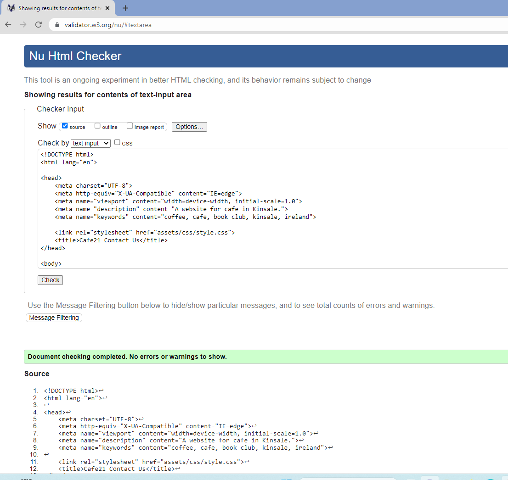

# Cafe21 Website

Developer: Grace
<!-- 
GitHub repository: **[https://github.com/grace-ghb/Cafe21](https://github.com/grace-ghb/Cafe21)**

Live website: **[https://grace-ghb.github.io/Cafe21/](https://grace-ghb.github.io/Cafe21/)** -->

Cafe21 is a fictional website designed to be responsive for users to easily browse through the website between desktop, tablet, and smartphone.

To view the website, click [here]( https://grace-ghb.github.io/Cafe21/).

Cafe21 is a café located in Kinsale a lovely town in Cork, Ireland.  This café provided exotic coffee and lovely meals throughout the day and the owners have organized a book club where they have a meeting once a week between the members.  

## Table of Contents

1. [User Experience (UX)](#user-experience-ux)
   * [Initial Discussion](#initial-discussion)
   * [User Stories](#user-stories)
   * [Typography](#typography)
   * [Wireframes](#wireframes)
  
2. [Design](#design)
    * [Typography](#typography)
    * [Wireframes](#wireframes)
    * [Features](#features)
3. [Technologies Used](#technologies-used)
    * [Languages Used](#technologies-used)
    * [Frameworks, Libraries & Programs Used](#technologies-used)
4. [Testing](#validator-testing)
    * [W3C Validator](#validator-testing)
    * [Accessibility](#accessibility)
    * [Home Page](#validator-testing)
    * [Menu Page](#validator-testing)
    * [Gallery Page](#validator-testing)
    * [Contact Us Page](#validator-testing)
    * [Sign Up Page](#validator-testing)
    * [Tools Testing](#tools-testing)
    * [General Testing](#general-testing)
5. [Finish Products](#finish-products)
    * [Home Page](#finish-products)
    * [Menu Page](#finish-products)
    * [Gallery Page](#finish-products)
    * [Contact Us Page](#finish-products)
    * [Sign Up Page](#finish-products)
6. [Deployment](#deployment)
    * [GitHub Pages](#github-pages)
7. [Credits](#credits)
    * [Content](#content)
    * [Code](#code)
    * [Acknowledgments](#acknowledgements)
  
---

## User Experience (UX)

### Initial Discussion

Cafe21 is a website for a café provided coffee, tea, and lovely foods services and with a book club where the members meet once a week to discussed about the books they enjoy and exchange ideas of books they read. Members get together to hanging out, to socialise and to enjoy a cup of nice coffee with the right friends. Users can check out the menu from the website where it shows the beverage and foods provided in the café.  From the gallery they can see some pictures of the foods and drinks sold in the café and they can check the location through the website with address, google maps, emails, and telephone numbers.  Users who are interested also can sign up as one of their book club’s members.

### User stories

* Users can view the site on different devices e.g., desktop, tablet, and smartphone.
* Users can check what is the price and what kind of foods are offer in the menu in the café.
* Users can see what the food and drink are offer look like.
* There is a google map that users can located the location of the café.  They can email or phone in to make enquiries.
* There is a form provided where users can sign up to join the books club.
  
[Back to Table of Contents](#table-of-contents)  

## Design

### Typography

[Google Fonts]( https://fonts.google.com/) was used for the website.

*	The logo used satisfy font and cursive and sans-serif as the fallback font.
*	The body used Recursive font and sans-serif as a fallback font.

### Wireframes

[Balsamiq]( https://balsamiq.com/) has been used to create wireframes for the website.

Home Page Wireframes

Menu Page Wireframes

Gallery Page Wireframes

Contact Us Page Wireframes

Sign Up Page Wireframes

[Back to Table of Contents](#table-of-contents)

### Features

There are five pages in this website which the users can browse through each using the navigation bar.

#### Navigation Bar

*	The navigation bar is identical in all five pages.
*	The Logo is a navigation bar that allow user to navigate to home page or as a refresh page which will bring the user back to the home page.
*	Others navigation bar includes Home, Menu, Gallery, Contact Us, and Sign Up allow users to navigate from page to page easily.

#### Footer

*	The footer is all same in five pages.
*	The footer comprised copyright statement and social media links.
*	The social media links is for users to keep in connected and keep up to date with any activities e.g., if there is any special offer or any events for the book club members.

#### The Landing

*	The landing includes an image of coffee fruits with text overlay.
*	The overlay text is a quote by Henry Rollins to attract coffee lovers.
*	The animation effect is to catch the eyes of the users.

#### The Ethos Section

*	The landing includes an image of coffee fruits with text overlay.
*	The overlay text is a quote by Henry Rollins to attract coffee lovers.
*	The animation effect is to catch the eyes of the users.
The Ethos Section

* Coffee And Me
  * This section introduces the café’s location and the owners’ passion.  Also mentioned the source of products so that users know where the product comes from.
* More Coffee, More Words
  * This section introduces the book club in the café.
  * The members meeting times are between 15:00pm to 17:00pm in the café.
  * The source of books read come from the café or donation and exchange from users.

#### Menu

*	Indicate foods served all-days from 8 am to 3 pm, Monday to Saturday.
*	This section shows what kind of drinks and foods sold in the café with the price indicated beside.

#### Gallery

*	This section is the pictures of some of the foods and drinks sold in the café.
*	Users can hover over the image and the opacity of the image show the individual image that the users are targeted.

#### Contact Us

*	The quotes encourage users to enjoy a lovely coffee with friends.
*	There is an image of a street view of the town where the café is.
*	This section contains location address, email address and phone numbers for users to keep in touch with.
*	Included also google maps for users to easily access the location if they are strange to environments.

#### Sign Up

*	This section is for users who wanted to sign up for the book club’s membership.
*	This is to encourage users to socialize with more people who like coffee and books.

### Technologies Used

* Languages Used
  * HTML and CSS were used to create this site.

* Frameworks, Libraries and Programs Used
  * [Balsamiq]( https://balsamiq.com/) is used to create wireframes.
  * [Github]( https://github.com/) is used to save and store the files for the website.
  * [Codeanywhere](https://app.codeanywhere.com/) was used for writing code, committing and then push to GitHub.
  * [Am I Responsive](https://ui.dev/amiresponsive) is used to test the responsiveness of the website when used in the desktop, tablets, and mobile devices.
  * [Chrome DevTools](https://developer.chrome.com/docs/devtools/) is used to support the coding process and test the website’s responsiveness during coding.
   

  * [Image Compressor](https://imagecompressor.11zon.com/en/image-compressor/compress-jpeg-to-100kb.php)
  * [Font Awesome]( https://fontawesome.com/) was used to add icons.
  * [W3C Markup Validation Service](https://validator.w3.org/#validate_by_input) was used to validate the HTML codes.
  * [W3C CSS Validation Service]( https://jigsaw.w3.org/css-validator/)  was used to validate the CSS codes.
  
### Validator Testing

  1. W3C Validation Service was used to validate the codes for errors.

* [W3C Markup Validation Service](https://validator.w3.org/#validate_by_input) was used to validate the HTML codes.

Home Page Validation

* `<meta http-equiv="cache-control" content="no-cache">`
* `<meta http-equiv="expires" content="0">`
* `<meta http-equiv="pregma" content="no-cache">`
* Removed the above three codes from `<head>`, errors solved.

* Duplicate ID logo and menu is due to copy and paste. Removed the duplicate to solve the error.
* After the adjustment, no errors or warnings show.

Menu Page Validation

* show as article are used as elements for the drinks and foods container without using heading.
* Warning was ignored.

Gallery Page Validation

* No errors or warnings to show.

Contact Us Page Validation

*	Error of the `<a>`element when change the google map from imagery to googles map.
*	Action taken by removed the `<a>`

*	After action taken no errors or warnings to show.

Sign Up Page Validation

*	No errors or warnings to show.

2. [W3C CSS Validation Service]( https://jigsaw.w3.org/css-validator/)  was used to validate the CSS codes.

### Accessibility

*	Used Lighthouse in Chrome DevTools to test the performance of the website.

Home Page

Menu Page

Gallery Page

Contact Us Page

Sign Up Page

### Tools Testing

* [Chrome DevTools]( https://developer.chrome.com/docs/devtools/) was used to test and modify HTML elements and CSS styles in the project.
* [Am I Responsive](https://ui.dev/amiresponsive) is used to test the responsiveness of the website when used in the desktop, tablets, and mobile devices.
-Browser Compatibility
Google Chrome – No appearance, responsiveness nor functionality issues.
Microsoft Edge -  No appearance, responsiveness nor functionality issues.
Modzilla Fox - No appearance, responsiveness nor functionality issues.

### General Testing

* Links
  * Test each navigation links and worked as expected.
  * Test each social media links and opened as expected in a new tab for external link.
* Submit Button
  * The form worked correctly and directed to fill in the input column.
  * The button click effect worked as expected, when click on the color of the button becomes darker.
* Email
  * When hover over the color change into red.
* Phone Numbers
  * When hover over the color change into red.
  * When browse with a mobile phone, click on the numbers , the numbers will dial and indicated connected.

* Google Maps
  * When clicking on, will bring you to a new tab of large size Google Maps.
* Gallery Images
  * When the mouse hover over, the image will show lesser opacity to indicate targeted individuals image.

[Back to Table of Contents](#table-of-contents)

## Finish Products

Home Page Site

Menu Page Site

Gallery Page Site

Contact Us Page

Sign Up Page

[Back to Table of Contents](#table-of-contents)

## Deployment

*	This website was develop using Visual Studio Code from Codeanywhere then committed and push to GitHub.

### GitHub Pages

1. Steps to deploy this website to GitHub Pages from its GitHub repository:
2. Sign in to the GitHub site.
3. Choose the repository intended to deploy.
4. Go to setting.
5. Click on the ‘Page’ at the side menu.
6. Go to Build and deployment.
7. At Source select ‘Deploy from a branch’
8. At the Branch, select ‘main’, ‘/(root)’ and click save.
9. Go to GitHub Pages at the top.
10. Your site is live at [https://grace-ghb.github.io/cafe21/](https://grace-ghb.github.io/Cafe21/)
11. Click on ‘Visit site’ and it will bring you to the new tab of your website.

## Credits

### Content
  * All content written by the developer.

* Imagery have been obtained from the
  * [Pexels](https://www.pexels.com/)
  * [Istockphoto](https://www.istockphoto.com)
  * [Joanne]( https://www.facebook.com/joanne.how)
  * [Yvonne]( https://www.facebook.com/yvonne.lau.73700)

* Slogan have been obtained from
  * [The Brand Box]( https://thebrandboy.com/121-catchy-coffee-shop-slogans-and-taglines/)

* Coffee Quotes obtained from website
  * [Coffee Affection]( https://coffeeaffection.com/coffee-quotes/)
* [Font Awesome]( https://fontawesome.com/) was used to add icons.
* Icons for social media links at the footer for Facebook and Instagram.
* Icons show on the Ethos, a loving eyes with smiley face and a reading book.
* Icons of a berry, a lemon, a leaf, and a thumbs up show in Menu page.

### Code

Codes were consulted regularly for better understanding and knowledge from the website:

* [Stackoverflow]( https://stackoverflow.com/)
* [W3Schools]( https://www.w3schools.com/)
* [Tutorials Point]( https://www.tutorialspoint.com/)
* [Modzilla Developer]( https://developer.mozilla.org/)
* [FreeCodeCamp](https://www.freecodecamp.org/learn/2022/responsive-web-design/)
* [Love Running]( https://github.com/Code-Institute-Solutions/readme-template/blob/master/README.md)
* [Kera Cudmore]( https://github.com/kera-cudmore/Bully-Book-Club/blob/main/README.md)
* [josswe26]( https://github.com/josswe26/pura-vida-spa/blob/main/README.md#user-stories)

### Acknowledgements

*	My husband for his support and understanding.
*	My mentor, Marcel, for his invaluable feedback and guidance especially on how to write a proper commit message.
*	Code Institute and the Slack Community for their support, encouragement, and sharing of knowledge make it possible for me work on the project.

[Back to Table of Contents](#table-of-contents)

[Top](#cafe21-website)
