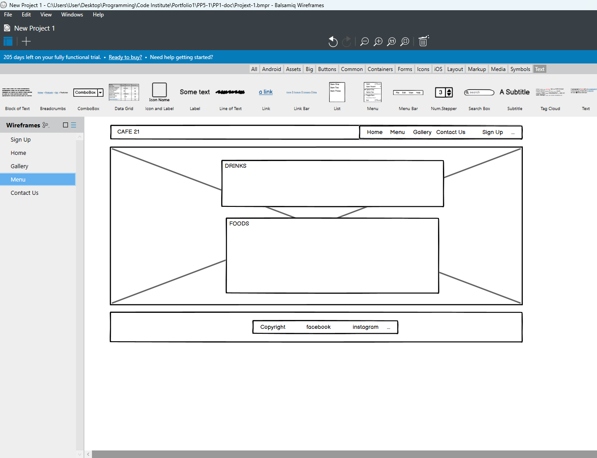

# Cafe21 Website

Developer: Grace

Cafe21 is a fictional website designed to be responsive for users to easily browse through the website between desktop, tablet, and smartphone.

To view the website, click [here]( https://grace-ghb.github.io/Cafe21/).

Cafe21 is a café located in Kinsale a lovely town in Cork, Ireland.  This café provided exotic coffee and lovely meals throughout the day and the owners have organized a book club where they have a meeting once a week between the members.  

## Table of Contents
---
1. [User Experience (UX)](#)
   * [Initial Discussion](#)
   * [User Stories](#)
   * [Typography](#)
   * [Wireframes](#)
  
2. [Design](#)
    * [Typography](#)
    * [Wireframes](#)
    * [Features](#)
3. [Technologies Used](#)
    * [Languages Used](#)
    * [Frameworks, Libraries & Programs Used](#)
4. [Testing](#)
    * [W3C Validator](#)
    * [Accessibility](#)
    * [Home Page](#)
    * [Menu Page](#)
    * [Gallery Page](#)
    * [Contact Us Page](#)
    * [Sign Up Page](#)
    * [Tools Testing](#)
    * [General Testing](#)
5. [Deployment](#)
    * [GitHub Pages](#)
6. [Credits](#)
    * [Content](#)
    * [Media](#)
   * [Acknowledgments](#)
  
***

## User Experience (UX)

### Initial Discussion
Cafe21 is a website for a café provided coffee, tea, and lovely foods services and with a book club where the members meet once a week to discussed about the books they enjoy and exchange ideas of books they read. Members get together to hanging out, to socialise and to enjoy a cup of nice coffee with the right friends. Users can check out the menu from the website where it shows the beverage and foods provided in the café.  From the gallery they can see some pictures of the foods and drinks sold in the café and they can check the location through the website with address, google maps, emails, and telephone numbers.  Users who are interested also can sign up as one of their book club’s members.

### User stories
* Users can view the site on different devices e.g., desktop, tablet, and smartphone.
* Users can check what is the price and what kind of foods are offer in the menu in the café.
* Users can see what the food and drink are offer look like.
* There is a google map that users can located the location of the café.  They can email or phone in to make enquiries.
* There is a form provided where users can sign up to join the books club.
  
### Typography
[Google Fonts]( https://fonts.google.com/) was used for the website.
-	The logo used satisfy font and cursive and sans-serif as the fallback font.
-	The body used Recursive font and sans-serif as a fallback font.

### Wireframes
[Balsamiq]( https://balsamiq.com/) has been used to create wireframes for the website.

Home Page Wireframes

Menu Page Wireframes

Gallery Page Wireframes

Contact Us Page Wireframes

Sign Up Page Wireframes

